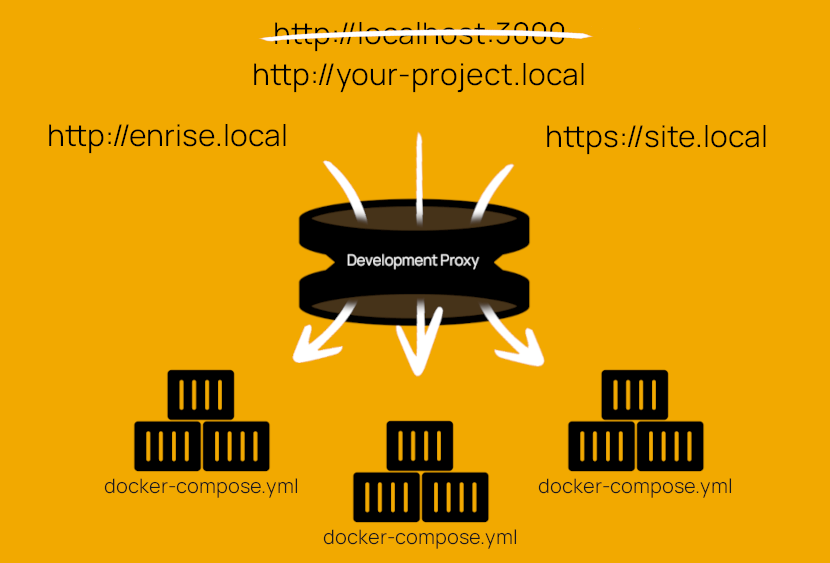

# Enrise development proxy

## Why?

Are you running multiple docker containers/projects? Then it's very likely
that you struggle with the port numbers that needs to be assigned to every
container. This project gives you an easy way to add local domain names to
your docker containers.

- http://localhost:3000 :arrow_right: http://dashboard.local
- http://localhost:9090 :arrow_right: https://api.example.local
- etc...
- plus, it adds an easy way to add https

## How does it work?

With 5 simple steps you should be able to use hostnames instead of ports:

1. Add a shell snippet that starts a Traefik proxy container
2. Add the Traefik rules to your docker compose file
3. Link your docker network to the `development-proxy` network
4. Add your local url to your `/etc/hosts` file 
5. (optional) Add SSL certificates for https

Ready? [Set up the development proxy](./setup.md) for your project(s).

## Running

Once you have the development proxy running:

- Catch localhost traffic on port 80/443, and reroute your local domains
- The Traefik dashboard is available at http://localhost:10081

## Documentation

- [Set up the development proxy](./setup.md)
- [Set up https with SSL](./setup-https.md)
